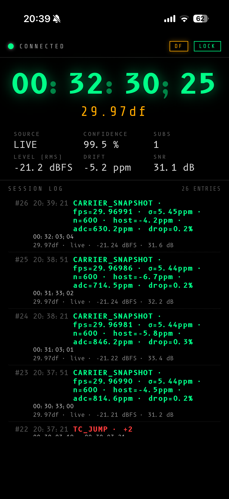

# smpte-bridge

Fan-out sidecar for the SMPTE timecode analyzer. The browser-side analyzer
publishes timecode frames over WebSocket; this process rebroadcasts the JSON
feed to any number of subscribers.

## Run

### With Docker (recommended — no Node toolchain needed)

```
cd smpte-bridge
docker compose up -d
```

The container binds all interfaces (`HOSTS=0.0.0.0`) and maps `:8765` to the
host. Stop it with `docker compose down`. Override the port by editing
`docker-compose.yml` (uncomment `PORT`) or set it in the environment.

### With Node directly

```
cd smpte-bridge
npm install
npm start
```

`127.0.0.1` is always bound so a same-machine analyzer can reach
`ws://localhost:8765/ingest`. `HOSTS` (comma-separated) adds extra interfaces
without exposing all of LAN; `HOST` is accepted as an alias. `npm start` sets
`HOSTS=$(tailscale ip -4)` so the bridge is reachable over Tailscale too. Pass a
wildcard (`HOSTS=0.0.0.0`, as the Docker image does) to bind every interface;
the wildcard already covers localhost, so it is bound alone. Override port with
`PORT=9000`.

## Connecting from the hosted analyzer (HTTPS) — mixed content

The [hosted analyzer](https://macswg.github.io/timecode_greenalyzer/) is served
over **HTTPS**. Browsers allow an HTTPS page to open an insecure `ws://`
connection **only to localhost**, so:

- **Bridge on your own machine:** works as-is — publish to
  `ws://localhost:8765/ingest` from the hosted page.
- **Bridge on another machine** (e.g. a Tailscale IP): blocked as mixed content.
  You need a secure `wss://` connection. Pick one of:
  1. Run the analyzer from source over `http://localhost:5173` instead of the
     hosted page — the mixed-content rule doesn't apply, so plain `ws://<ip>`
     works; **or**
  2. Enable the bridge's built-in TLS (see below) and connect with
     `wss://<host>:8765/ingest`; **or**
  3. Put a TLS reverse proxy in front of the bridge (Caddy, nginx, or a Tailscale
     Funnel / cloud host) and connect with `wss://<host>/ingest`.

## TLS / `wss://` (bring your own cert)

The bridge can serve `https`/`wss` directly. Set **both** `TLS_CERT` and
`TLS_KEY` to PEM file paths and it switches from `http`/`ws` to `https`/`wss`:

```
TLS_CERT=/path/cert.pem TLS_KEY=/path/key.pem node src/index.js
```

The bridge **uses** a cert you provide — it never obtains or renews one. Good
sources:

- **Tailscale:** `tailscale cert <name>.ts.net` issues a real, browser-trusted
  Let's Encrypt cert for your tailnet name. This is the easiest path to a working
  `wss://` from the hosted analyzer to a remote bridge.
- **Let's Encrypt / any CA:** point the vars at your existing fullchain + key.
- A **self-signed** cert works too, but browsers won't trust it until you install
  it on each device — fine for testing, awkward for a phone.

Guardrails (by design):

- **Default is unchanged.** With neither var set, the bridge serves plain
  `http`/`ws` exactly as before — non-TLS users feel nothing.
- **Setting only one of the two** (or pointing at an unreadable file) makes the
  bridge **refuse to start** with a clear error, rather than silently falling
  back to insecure `http`.
- **TLS is per-instance and `wss`-only.** Once enabled, plain `ws://localhost`
  will not connect to that instance — switch the analyzer's publisher URL to
  `wss://`. The startup banner prints the active scheme.

With Docker, mount the cert files in and set the vars:

```yaml
# docker-compose.yml (override)
environment:
  HOSTS: "0.0.0.0"
  TLS_CERT: "/certs/cert.pem"
  TLS_KEY: "/certs/key.pem"
volumes:
  - /path/to/certs:/certs:ro
```

## Endpoints

- `ws://localhost:8765/ingest` — analyzer connects here as the single publisher.
- `ws://localhost:8765/subscribe` — downstream apps connect here; receive the
  JSON feed verbatim.
- `http://localhost:8765/status` — JSON snapshot (publisher state, subscriber
  count, frame counters, last timecode).
- `http://localhost:8765/` — phone-friendly live viewer (see below).

## Phone viewer

Open `http://localhost:8765/` in any browser to see the running timecode, the
current error tags, and a live **mirror of the analyzer's session log** (the same
entries, ids, counts, and notes — not a separate log the phone keeps). The page
connects to `/subscribe` itself and auto-reconnects with 1 s → 10 s back-off. The
log is read-only on the phone; notes are authored in the analyzer.

To view from a phone over Tailscale:

1. Start the bridge (`npm start`) and click **▶ PUBLISH** in the analyzer.
2. Get the Mac's Tailscale IP: `tailscale ip -4`.
3. On the phone (Tailscale connected), open `http://<that-ip>:8765/`.

The viewer needs no audio input of its own — it's purely a readout of whatever
the analyzer is currently publishing. Drop-frame rates render with `;` and an
orange rate label; non-drop with `:` and blue, matching the analyzer.

<p align="center"></p>

<p align="center"><em>The phone viewer mirroring a live 29.97 DF feed, including the analyzer's session log.</em></p>

## Message types

- `{"type":"tc", t, seq, hh, mm, ss, ff, rate, dropFrame, carrierRate, cadenceFps,
  cadenceDropFrame, carrierCadenceMismatch, fieldMarkBehavior, bgf, userBits, source,
  ltcLocked, frameValid, levelDbFS, peakDbFS, driftPpm, dropoutPct, snr, errors}`
  emitted every tick (~30 Hz). `seq` is a publisher-monotonic counter starting at 1.
  `rate` is the combined SMPTE rate key (e.g. `"29.97df"`); `dropFrame` is boolean.
  `carrierRate` / `cadenceFps` / `cadenceDropFrame` are the independent carrier-rate
  and counting-cadence observations (combined into `rate` for convenience).
  `fieldMarkBehavior` is `"TOGGLING"` / `"STATIC"` / `null` (50/60 frame-pair vs
  wide-LTC). `userBits` is an 8-char hex string (UB1..UB8). Fields with no value yet
  (e.g. before the carrier classifier commits) are `null`.
- `{"type":"error", t, seq, tc, rate, errors}` emitted once per error-set transition.
  `tc` is a formatted timecode string; `;` is used as the frame separator for drop-frame.
- `{"type":"continuity", t, seq, breakType, delta, from, to, rate}` emitted when
  a continuity break is detected. `breakType` is `"REPEAT"` (freeze frame, delta = 0),
  `"JUMP"` (edit splice / dropout, delta > 1), or `"REWIND"` (backwards, delta < 0).
  `from` and `to` are formatted timecode strings. Gaps ≥ 500 ms between decoded frames
  reset continuity tracking and do not produce this message.
- `{"type":"log", t, entries}` full session-log snapshot, published whenever the
  analyzer's log changes (throttled to ≤ 1 send / 750 ms; bursts of per-second
  count flushes coalesce into one). `entries` is the whole log array, oldest-first,
  each `{id, t, tc, from?, rate, source, levelDbFS, snr, errors, count, note?}`.
  It's a snapshot, not a delta — idempotent, so a dropped message self-heals on the
  next one. The bridge caches the latest snapshot and replays it in `hello`.
- `{"type":"status", t, subscribers, publisher}` heartbeat on connection
  state changes.
- `{"type":"hello", t, lastTc, lastLog}` sent to each new subscriber on connect,
  so a phone joining mid-session gets the current timecode and full session log
  immediately. Either field is `null` if nothing has been published yet.

## Quick test

```
# in another terminal:
npx wscat -c ws://localhost:8765/subscribe
```


Dark-blue is wscat's default color for incoming messages — it tags them with ANSI color 34 (blue), which on iTerm2's default dark theme is hard to read.

To fix it:

​	Pipe through jq — kills wscat's coloring entirely
​	`npx wscat -c ws://localhost:8765/subscribe | jq -C .`
​	jq -C applies its own (much more readable) color scheme. As a bonus you get pretty-printing.

​	If you don't want JSON pretty-printing, just plain text:
​	`npx wscat -c ws://localhost:8765/subscribe | cat`
​	Piping to anything strips wscat's terminal-detection, so it falls back to uncolored output.


Phases 2+ (OSC fan-out, Art-Net timecode, optional MTC) will be added as
additional listeners on the same ingest stream.
